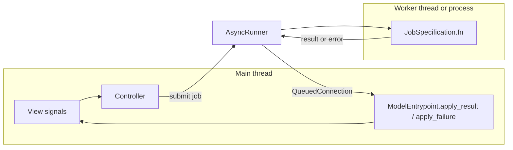

# How async core jobs work

This guide describes the current async job path in AROW: how controllers submit blocking core work, what a `CoreRuntimeWork` must return, how results and failures are applied on the Qt main thread, how process-backed map rendering fits into the same pipeline, and how runtime logging remains traceable across workers.

It matches the implementation in `src/controller/runner.py`, the domain
subcontrollers under `src/controller/domains/`, `src/core/entrypoint.py`, and
`src/core/work/`. For the runner's internal state machine, deadline arbitration,
and Qt terminal commit point, see
[`src/controller/runner.md`](../src/controller/runner.md).

Each work module has a same-basename Markdown companion with a visual trace from
controller submission through main-thread application. The built-in job table
below links to those diagrams.

## Mental model

| Layer | Role |
|--------|------|
| **View (`gui/`)** | Emits signals or calls controller methods in response to UI events. Must not block on slow I/O or CPU-heavy work. |
| **Controller (`controller/`)** | Decides *when* to run work, submits the job, and wires completion / failure callbacks. `AppController` owns the shared `AsyncRunner`; domain slices live under `controller/domains/`. |
| **Core (`core/`)** | Holds blocking runtime work (`CoreRuntimeWork` subclasses), outcome dataclasses, `ModelEntrypoint`, and main-thread apply/failure handlers. |

Heavy or blocking operations should run **outside** the GUI thread. The app routes them through a single **`AsyncRunner`** (typically owned by `AppController`), using **`JobSpecification`** and **`JobHandler`**.

## End-to-end pathway

1. **Something triggers the controller** — for example a categorized `signals` handler (e.g. `signals.DEVICE.RefreshDeviceListRequested` from `gui.signals`), a menu action, or a model event wired in `_connect_model_signals`.
2. **The controller submits a job** — usually via `Controller._submit_model_entrypoint_async_call(...)`, which wraps `AsyncRunner.submit(JobSpecification(...))` and binds per-job signals.
3. **The runner picks a pool** — thread vs process from the required, explicit
   `job_type` (see below).
4. **The worker runs `JobSpecification.fn`** — usually a `ModelEntrypoint` method that instantiates a `CoreRuntimeWork` and calls its blocking `run()`. This runs in a **worker thread or process**, not on the Qt main thread.
5. **Completion is marshaled to the main thread** — `AsyncRunner` uses internal Qt signals with `QueuedConnection` so **`Completed`**, **`Failed`**, and **`Cancelled`** slots run on the GUI thread.
6. **The core entrypoint applies the outcome** — controller submissions wire completion directly to `ModelEntrypoint.apply_result(...)` and failure directly to `apply_failure(...)`. The entrypoint dispatches to the registered work applier, and the view updates from core-bus signals.



## Built-in core runtime jobs

`src/core/work/works_repository.py` is the canonical catalog for the built-in async core jobs:

| Job origin | Entrypoint method | Work class | Outcome |
|--------|------|------|------|
| `startup_core_runtime` | `ModelEntrypoint.startup()` | [`StartupCoreRuntimeWork`](../src/core/work/startup_work.md) | `StartupOutcome` |
| `authentification_workflow` | `ModelEntrypoint.authentificate_device(...)` | [`AuthenticateDeviceWork`](../src/core/work/authentificate_device_work.md) | `AuthentificateDeviceOutcome` |
| `host_install_identity` | `ModelEntrypoint.run_host_install_identity()` | [`HostInstallIdentityWork`](../src/core/work/host_install_identity_work.md) | `HostInstallIdentityOutcome` |
| `refresh_device_list` | `ModelEntrypoint.refresh_known_devices()` | [`RefreshKnownDevicesWork`](../src/core/work/refresh_known_devices_work.md) | `RefreshKnownDevicesOutcome` |
| `close_core_runtime` | `ModelEntrypoint.close_core_runtime()` | [`CloseCoreRuntimeWork`](../src/core/work/close_work.md) | `CloseOutcome` |
| `render_map` | `ModelEntrypoint.render_map(simulation_id, application_dir)` | [`RenderMapWork`](../src/core/work/render_map_work.md) | `RenderMapOutcome` |
| `validate_simulation_marker_location` | `ModelEntrypoint.validate_simulation_marker_location(...)` | [`ValidateSimulationMarkerLocationWork`](../src/core/work/validate_simulation_marker_location_work.md) | `ValidateSimulationMarkerLocationOutcome` |

When you add a new core runtime job, keep this catalog in sync so result/failure dispatch stays auditable.

## Preferred API: `_submit_model_entrypoint_async_call`

`Controller` exposes a single helper intended for model-entrypoint async work:

```python
handle = self._submit_model_entrypoint_async_call(
    name="my_job",
    fn=my_callable,
    job_type="thread",              # required: "thread" | "process"
    description="Optional human-readable description",
    args=(),
    kwargs={},
    on_completed=my_on_completed,   # Callable[[object], None]
    on_failed=my_on_failed,          # Callable[[JobError], None]
    on_cancelled=my_on_cancelled,    # Callable[[], None]
    on_progress=my_on_progress,      # Callable[[ProgressEvent], None]
    timeout=None,                   # positive finite deadline in seconds
    priority=0,
    coalesce_key=None,
)
```

- **`fn`**: callable executed in the background. In normal AROW controller code this is a `ModelEntrypoint` method, not a raw work object.
- **Callbacks**: optional; each connected slot runs on the **Qt main thread** after the runner emits the corresponding signal (see docstring on `_submit_model_entrypoint_async_call` in `controller/controller.py`).
- **Return value**: a **`JobHandler`** — use `handle.job_id` with `runner.cancel(job_id)` if you need to cancel (see “Cancellation” below).

Subcontrollers that do not inherit `Controller` (e.g. `AdbSubController` in `controller/domains/`) typically delegate with:

```python
def _submit_model_entrypoint_async_call(self, *args, **kwargs):
    return self._app._submit_model_entrypoint_async_call(*args, **kwargs)
```

so every domain module shares **one** `AsyncRunner` from `AppController`.

## Recurring async jobs

Recurring controller work uses the app-owned `CronManager`; subcontrollers must
not construct their own repeating timers. A domain declares immutable `CronJob`
values through `declare_cron_jobs()`:

```python
def declare_cron_jobs(self) -> tuple[CronJob, ...]:
    return (
        CronJob(
            interval_ms=30_000,
            specification=JobSpecification(
                name="refresh_device_list",
                fn=self.model_entrypoint.refresh_known_devices,
                type="thread",
                coalesce_key="refresh_device_list",
                at_most_once=True,
            ),
            on_completed=self.model_entrypoint.apply_result,
            on_failed=self.model_entrypoint.apply_failure,
        ),
    )
```

`AppController` collects every domain declaration after signal wiring and calls
`CronManager.commit()` once. Commit starts one `helper.repeat(...)` Qt timer per
declaration; the first submission happens only after a full interval. When a
timer fires, the controller submits the stored `JobSpecification` through the
same shared `AsyncRunner` and binds the same main-thread lifecycle callbacks as
event-driven jobs.

Cron job names must be non-empty and unique, intervals must be positive, and no
declarations may be added after commit. Application shutdown pauses all cron
timers before draining work; an aborted shutdown resumes them, while successful
teardown stops them permanently. Fixed intervals are
process-local; wall-clock expressions and persisted schedules are not supported.

## Core work contract

AROW’s core async jobs follow a stricter contract now than an arbitrary background callable:

1. `run()` does blocking work only.
2. `run()` returns a concrete `CoreRuntimeWorkOutcome` subtype.
3. Qt-main-thread mutation, repository changes, and core signal emission happen in `apply_main_thread(...)`.
4. Worker failures are translated in `apply_failure_main_thread(...)`.

Minimal shape:

```python
@dataclass(frozen=True, slots=True)
class MyOutcome(CoreRuntimeWorkOutcome):
    value: str


class MyWork(CoreRuntimeWork[MyOutcome]):
    @preflight(check_server_started=True)
    def run(self) -> MyOutcome:
        return MyOutcome(value="done")

    @staticmethod
    def apply_main_thread(model_entrypoint: ModelEntrypoint, outcome: MyOutcome) -> None:
        ...

    @staticmethod
    def apply_failure_main_thread(
        model_entrypoint: ModelEntrypoint, error: BaseException
    ) -> None:
        ...
```

### `run()` preflight checks

`src/core/work/helper.py` provides the `@preflight(...)` decorator used by startup, authenticate, refresh, host install identity, and close work.

Available checks:

- `check_server_started=True`: resolve `_adb_server` / `adb_server` and require `is_server_running()`.
- `check_client_created=True`: resolve `_adb_client` / `adb_client` and require usable binary metadata.
- `check_device_not_paired=True`: require a valid target IP/port and reject an exact endpoint already present in `paired_devices`.
- `check_network_available=True`: require `refresh_network_availability()` to find a usable non-loopback host IPv4 route.
- `check_mdns_available=True`: require `refresh_mdns_availability()` to succeed.

Use `error_to_raise=` when a work needs a domain-specific exception such as `RefreshKnownDevicesError` or `DeviceAuthentificationError`. The decorator runs before the body of `run()`, so failed preflight should not partially mutate core state.

Wireless device authentication enables the duplicate-endpoint, network, and mDNS
checks. Startup, device refresh, and close do not require them because they must
remain usable with USB-connected devices.

## Result and failure dispatch

Controllers should usually not call a work’s static handlers directly. They call:

- `ModelEntrypoint.apply_result(result)`
- `ModelEntrypoint.apply_failure(error)`

`apply_result(...)` dispatches by **exact outcome type** using the registry built from `CORE_RUNTIME_WORKS`.

`apply_failure(...)` normalizes either:

- an `AsyncRunner` `JobError`-like object (`origin`, `exception`, `message`), or
- a plain `BaseException`

Routing order is:

1. By async job `origin` such as `refresh_device_list` or `startup_core_runtime`.
2. By exception type MRO for explicitly registered exceptions.
3. Fallback to `CoreRuntimeWork.emit_generic_error(...)`, which emits `CoreSignal.ERROR_RAISED`.

This origin-first rule matters because a generic `RuntimeError` raised inside one job should still reach that job’s failure handler instead of a generic fallback.

## Map rendering flow

Map rendering follows the same AsyncRunner contract as the ADB-facing jobs, but there are two design constraints worth calling out:

1. `MapSubController` submits `ModelEntrypoint.render_map(...)` with `job_type="process"` because Folium + geo dataset preparation is CPU-heavy enough to justify leaving the GUI thread and the thread pool alone.
2. `ModelEntrypoint.render_map(...)` is a `@staticmethod` that accepts only picklable inputs (`simulation_id`, a concrete output `Path`) so `ProcessPoolExecutor` can execute it without serializing the whole `ModelEntrypoint` object graph.

### Request path

`signals.UI.RenderMapRequested` lands in `MapSubController._on_render_map_requested(simulation_id)`.

- The controller first checks `<application_dir>/simulations/<simulation_id>/map/<simulation_id>.html`.
- If that HTML file already exists, the controller skips AsyncRunner entirely and forwards the path to the view immediately.
- Otherwise it submits `name="render_map"` with `coalesce_key=f"render_map:{simulation_id}"` and `job_type="process"`.

This means "render map" is lazy and cache-aware from the controller side: once the HTML artifact exists for a simulation, future UI opens reuse it until something else deletes or replaces that file.

### Worker-side behavior

`RenderMapWork.run()`:

1. Receives the concrete `output_dir` resolved by `ModelEntrypoint`.
2. Instantiates `MapRenderer()`.
3. Calls `MapRenderer.to_html(path=output_dir, prefix=simulation_id)`.
4. Returns `RenderMapOutcome(simulation_id=..., html_path=...)`.

If Folium or dataset rendering fails, the worker raises `RenderMapError(simulation_id=..., reason=...)`, which preserves the simulation id for main-thread reporting.

### Main-thread apply behavior

- `RenderMapWork.apply_main_thread(...)` emits `CoreSignal.MAP_RENDERED` with `MapRenderedPayload(simulation_id, html_path)`.
- `RenderMapWork.apply_failure_main_thread(...)` emits `CoreSignal.MAP_RENDER_FAILED` when the failure is a `RenderMapError`.
- `MapSubController` subscribes to both signals and forwards them to the view with `forward_map_rendered(...)` / `forward_map_render_failed(...)`.

Tests covering this path live in:

- `src/controller/domains/tests/test_map_sub_controller.py`
- `src/core/work/tests/test_render_map_work.py`

## Process-safe application logging across workers

AsyncRunner's process pool uses `setup_worker_logger` as its executor `initializer`. That detail matters operationally:

- The composition root generates a fresh UUID4 path and passes it to `setup_logger(...)`, which opens `<application_dir>/logs/<run_identifier>.log`.
- Root setup replaces any inherited `AROW_LOG_FILE`, then publishes the successfully configured primary or fallback path through that variable.
- Each spawned process derives an isolated sibling file named `<run_identifier>.worker-<pid>.log`.
- Workers inherit the same text or JSON Lines mode and the same rotation, retention, compression, redaction, and structured record schema.

This avoids unsupported concurrent Loguru rotation and compression on one file. To trace a run, analyze the main file and every sibling sharing its UUID4 prefix; Loguru's process metadata identifies each producer.

Do not confuse this with the user-facing activity log:

- `<run_identifier>.log` and `<run_identifier>.worker-<pid>.log`: low-level diagnostic Loguru sinks for the main process and isolated process workers.
- `activity_YYYYMMDD.log`: app activity log surfaced in the GUI and managed through `activity_log_file`.

## Lower-level API: `JobSpecification` + `submit` + `bind_handle_signals`

You can submit directly on the runner when you do not need the controller helper:

```python
from controller.runner import JobSpecification, AsyncRunner

runner: AsyncRunner = ...
job = JobSpecification(
    name="explicit_job",
    fn=callable,
    args=(),
    kwargs={},
    type="thread",        # required; use "process" for CPU-heavy work
    coalesce_key=None,
    timeout=None,
)
handle = runner.submit(job)
signals = runner.bind_handle_signals(handle)
signals.Completed.connect(my_slot)
signals.Failed.connect(my_failed_slot)
```

`bind_handle_signals(handle)` returns **`JobHandlerSignals`**: `Progress`, `Completed`, `Cancelled`, `Failed`. The runner also exposes **`runner.signals`** with the same event types but includes **`job_id`** as the first argument — useful for logging or multiplexed listeners.

## Thread vs process (`job_type`)

Every job must choose **`"thread"`** or **`"process"`** explicitly. Use a thread
for I/O-bound or quick work and a process for CPU-heavy work that must not occupy
the GUI process. The runner does not infer the pool from job names or coalescing
keys.

**Process pool caveat:** work runs in a separate process. The target callable must be **picklable** (top-level functions or picklable objects). Prefer **`"thread"`** for lambdas that close over complex objects, or keep **`fn`** as a module-level or clearly picklable entry point.

## Coalescing

If **`coalesce_key`** is set, submitting a new job with the same key **cancels the previous** pending job for that key. Cancellation promptly queues a Qt `Cancelled` commit and releases the key; the worker may continue but cannot compete with the new job. Use this for “latest wins” flows.

Current built-in keys include:

- `startup`
- `host_install_identity`
- `authentification`
- `refresh_device_list`
- `close`
- `render_map:<simulation_id>`

Map rendering uses a per-simulation coalesce key so repeated requests for the same simulation collapse to "latest wins" without discarding other simulations' work.

## Deadlines

`timeout` accepts a positive finite number of seconds, including fractional
values. The deadline starts immediately after the executor accepts the future;
it is monitored independently from worker completion.

When the deadline expires, the runner emits one `Failed` event whose `JobError`
retains the job name in `origin`, cleans active/coalescing state, and ignores any
later worker result. It also calls `Future.cancel()` so queued work is cancelled
when possible. Python executors cannot safely terminate an already-running thread
or one process-pool task, so running work is allowed to finish in the background.
If the job was already marked cancelled, deadline resolution emits `Cancelled`
instead of `Failed`.

Executor completion, failure, cancellation, and deadline expiry are terminal
proposals rather than immediately visible events. They cross the Qt queue and
are committed on the main thread. Immediately before committing, the runner
rechecks whether the job was cancelled or superseded by a newer job with the
same coalescing key. Either condition converts the queued proposal to
`Cancelled`, including a queued completion or failure. The runner removes the
job from private active state and coalescing state before notifying runner-level and
handle-level listeners, so reentrant listeners observe a terminal job as
inactive. Duplicate or late proposals after that commit are ignored.

## Cancellation

- **`runner.cancel(handle.job_id)`** marks the job cancelled, calls
  `Future.cancel()` best-effort, and promptly queues a `Cancelled` proposal. The
  main-thread commit releases active/coalescing state without waiting for the
  worker; any later outcome is ignored.
- The worker **`fn` does not automatically receive `CancelToken`** today; long-running core code would need an explicit contract if cooperative cancellation inside **`fn`** is required.

## Progress updates

`ProgressEvent` and **`on_progress`** / **`JobHandlerSignals.Progress`** are wired through **`AsyncRunner`**. The standard thread/process **`submit`** path does not inject an automatic progress callback into **`fn`**; emitting progress requires either extending the runner/pools or another agreed mechanism. Connecting **`on_progress`** is correct when you have a source of **`ProgressEvent`** instances.

## Result dispatch and lifecycle hooks

Core runtime submissions use one callback boundary:

1. Wire `on_completed=model_entrypoint.apply_result`.
2. Wire `on_failed=model_entrypoint.apply_failure`.
3. Register the work/outcome pair in `core/work/works_repository.py`; `ModelEntrypoint` uses that catalog to select `apply_main_thread` and uses the job origin to select `apply_failure_main_thread`.
4. Keep orchestration-only behavior in the owning subcontroller. If it must run after core application, bind a second per-job signal after `_submit_model_entrypoint_async_call(...)` returns. Qt invokes slots in connection order, so the entrypoint applier runs first.

Examples of controller-owned lifecycle behavior are startup chaining to host identity and clearing tracked map render handles. Application shutdown instead uses `AsyncRunner.request_drain(...)`: drain evaluation runs after terminal listeners, so synchronously chained jobs are included before quiescence becomes visible. These handlers must not duplicate model mutation or core signal emission.

`cancel_active(excluding_names=...)` and `request_drain(timeout)` are the public
shutdown primitives. Cancellation ends application-visible ownership promptly
but does not stop running Python work. A drain completes asynchronously on the
Qt main thread once no registered jobs remain, and its first empty check is
queued so callers can bind `Drained` and `TimedOut` before either signal is
possible.

## Device refresh and reconciliation

The refresh path is no longer “replace whatever list the server had”.

### Request-side guard

`AdbSubController._on_refresh_device_list_requested()` submits with `coalesce_key="refresh_device_list"` and `at_most_once=True`, so timer and UI requests cannot create overlapping refresh jobs.

### Worker-side behavior

`RefreshKnownDevicesWork.run()`:

1. Lists devices from `AdbServer.get_known_devices()`.
2. Enriches only `state == "device"` phones with shell properties.
3. Returns `RefreshKnownDevicesOutcome(devices=[...])`.

Shell-property enrichment is best-effort. Failures inside `AdbClient` enrichment helpers are logged and swallowed there, so a readable device list can still return.

### Main-thread apply behavior

`RefreshKnownDevicesWork.apply_main_thread(...)` now calls `ModelEntrypoint.reconcile_paired_devices(...)` instead of blindly replacing the repository.

Reconciliation rules:

- Match by current ADB connection id first.
- If the ADB id changed, fall back to `stable_key` **only** when the key is Tier-1 / collision-resistant (`hw:v1:` from `ro.serialno`).
- Never merge devices using Tier-2 fingerprint keys (`fp:v1:`); identical devices can collide.
- Update matching `Phone` objects in place so existing simulation references stay valid.
- Remove stale paired phones that are absent from discovery.
- Best-effort delete any simulation attached to a removed phone.
- Emit `CoreSignal.DEVICES_UPDATED` only when the paired set or device state actually changed.

There is one more normalization step before matching: discovery payloads are deduplicated by ADB connection id, keeping the **last** payload for each non-empty id and dropping blank ids.

## Types you will import

| Symbol | Module |
|--------|--------|
| `AsyncRunner`, `JobSpecification`, `JobHandler`, `JobHandlerSignals` | `controller.runner` |
| `JobError`, `ProgressEvent`, `CancelledError` | `controller.runner` |
| `_submit_model_entrypoint_async_call` | `Controller` subclasses (`controller.orchestration.AppController`, …) |

Tests with a fake runner live under **`src/core/tests/test_async_runner.py`** for behavioral examples.

## Checklist for a new async job

1. Add or reuse a `CoreRuntimeWork` subclass and a concrete `CoreRuntimeWorkOutcome`.
2. Put blocking logic in `run()` and main-thread mutation in `apply_main_thread(...)`.
3. Add `@preflight(...)` if the work depends on ADB server/client state.
4. Register the work in `src/core/work/works_repository.py` if it is a built-in entrypoint job.
5. Expose a `ModelEntrypoint` method that instantiates the work and returns its outcome.
6. Choose `job_type` and `coalesce_key` deliberately.
7. Wire completion and failure directly to `ModelEntrypoint.apply_result(...)` and `apply_failure(...)`.
8. Add subcontroller lifecycle handlers only for orchestration that must happen after application or cancellation.
9. Avoid touching Qt widgets or the core signal bus directly from `run()`.

## Troubleshooting

| Symptom | What to check |
|--------|------|
| Refresh requests are ignored while one is running | This is expected with `at_most_once=True`; use `is_active(handle)` while debugging and confirm the active job eventually commits. |
| A work fails before its body runs | Check `@preflight(...)` conditions and the work’s `error_to_raise=` mapping. |
| `apply_result(...)` logs “unsupported result type” | The returned outcome type is not registered in the built-in work catalog and has no custom applier. |
| A reconnect creates a second device row instead of updating the existing one | The handset probably lacks a Tier-1 `hw:v1:` stable key, so reconciliation intentionally avoids merging on Tier-2 fingerprint keys. |
| Map opens the failure placeholder after a background render | Check every runtime log sharing the run's UUID4 prefix for `RenderMapWork` errors and confirm the process job returned `RenderMapOutcome` rather than `RenderMapError`. |
| Map reopens instantly without starting a new job | Confirm the cached HTML file already exists under `<application_dir>/simulations/<simulation_id>/map/`; this is expected lazy-load behavior. |
