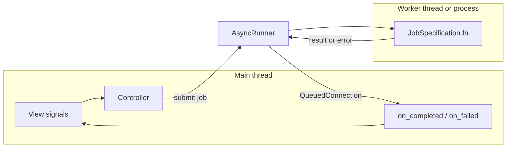

# How async core jobs work

This guide describes the current async job path in AROW: how controllers submit blocking core work, what a `CoreRuntimeWork` must return, how results and failures are applied on the Qt main thread, and how device refresh now reconciles paired phones safely.

It matches the implementation in `src/controller/runner.py`, `src/controller/core_work_callbacks.py`, `src/controller/domains/adb_sub_controller.py`, `src/core/entrypoint.py`, and `src/core/work/`.

## Mental model

| Layer | Role |
|--------|------|
| **View (`gui/`)** | Emits signals or calls controller methods in response to UI events. Must not block on slow I/O or CPU-heavy work. |
| **Controller (`controller/`)** | Decides *when* to run work, submits the job, and wires completion / failure callbacks. `AppController` owns the shared `AsyncRunner`; domain slices live under `controller/domains/`. |
| **Core (`core/`)** | Holds blocking runtime work (`CoreRuntimeWork` subclasses), outcome dataclasses, `ModelEntrypoint`, and main-thread apply/failure handlers. |

Heavy or blocking operations should run **outside** the GUI thread. The app routes them through a single **`AsyncRunner`** (typically owned by `AppController`), using **`JobSpecification`** and **`JobHandler`**.

## End-to-end pathway

1. **Something triggers the controller** — for example a categorized `signals` handler (e.g. `signals.DEVICE.RefreshDeviceListRequested` from `gui.signals`), a menu action, or a model event wired in `_connect_model_signals`.
2. **The controller submits a job** — usually via `Controller._submit_model_entrypoint_async_call(...)`, which wraps `AsyncRunner.submit(JobSpecification(...))` and binds per-job signals.
3. **The runner picks a pool** — thread vs process from `job_type` or `"auto"` (see below).
4. **The worker runs `JobSpecification.fn`** — usually a `ModelEntrypoint` method that instantiates a `CoreRuntimeWork` and calls its blocking `run()`. This runs in a **worker thread or process**, not on the Qt main thread.
5. **Completion is marshaled to the main thread** — `AsyncRunner` uses internal Qt signals with `QueuedConnection` so **`Completed`**, **`Failed`**, and **`Cancelled`** slots run on the GUI thread.
6. **Callbacks update state** — they validate the result type, call `ModelEntrypoint.apply_result(...)` or `apply_failure(...)`, and then the view updates from core-bus signals.



## Built-in core runtime jobs

`src/core/work/works_repository.py` is the canonical catalog for the built-in async core jobs:

| Job origin | Entrypoint method | Work class | Outcome |
|--------|------|------|------|
| `startup_core_runtime` | `ModelEntrypoint.startup()` | `StartupCoreRuntimeWork` | `StartupOutcome` |
| `authentification_workflow` | `ModelEntrypoint.authentificate_device(...)` | `AuthenticateDeviceWork` | `AuthentificateDeviceOutcome` |
| `host_install_identity` | `ModelEntrypoint.run_host_install_identity()` | `HostInstallIdentityWork` | `HostInstallIdentityOutcome` |
| `refresh_device_list` | `ModelEntrypoint.refresh_known_devices()` | `RefreshKnownDevicesWork` | `RefreshKnownDevicesOutcome` |
| `close_core_runtime` | `ModelEntrypoint.close_core_runtime()` | `CloseCoreRuntimeWork` | `CloseOutcome` |

When you add a new core runtime job, keep this catalog in sync so result/failure dispatch stays auditable.

## Preferred API: `_submit_model_entrypoint_async_call`

`Controller` exposes a single helper intended for model-entrypoint async work:

```python
handle = self._submit_model_entrypoint_async_call(
    name="my_job",
    fn=my_callable,
    description="Optional human-readable description",
    args=(),
    kwargs={},
    on_completed=my_on_completed,   # Callable[[object], None]
    on_failed=my_on_failed,          # Callable[[JobError], None]
    on_cancelled=my_on_cancelled,    # Callable[[], None]
    on_progress=my_on_progress,      # Callable[[ProgressEvent], None]
    job_type="auto",                # "auto" | "thread" | "process"
    timeout=None,                   # seconds, passed to Future.result()
    priority=0,
    coalesce_key=None,
)
```

- **`fn`**: callable executed in the background. In normal AROW controller code this is a `ModelEntrypoint` method, not a raw work object.
- **Callbacks**: optional; each connected slot runs on the **Qt main thread** after the runner emits the corresponding signal (see docstring on `_submit_model_entrypoint_async_call` in `controller/controller.py`).
- **Return value**: a **`JobHandler`** — use `handle.job_id` with `runner.cancel(job_id)` if you need to cancel (see “Cancellation” below).

Subcontrollers that do not inherit `Controller` (e.g. `AdbSubController` in `controller/domains/`) typically delegate with:

```python
def _submit_model_entrypoint_async_call(self, *args, **kwargs):
    return self._app._submit_model_entrypoint_async_call(*args, **kwargs)
```

so every domain module shares **one** `AsyncRunner` from `AppController`.

## Core work contract

AROW’s core async jobs follow a stricter contract now than an arbitrary background callable:

1. `run()` does blocking work only.
2. `run()` returns a concrete `CoreRuntimeWorkOutcome` subtype.
3. Qt-main-thread mutation, repository changes, and core signal emission happen in `apply_main_thread(...)`.
4. Worker failures are translated in `apply_failure_main_thread(...)`.

Minimal shape:

```python
@dataclass(frozen=True, slots=True)
class MyOutcome(CoreRuntimeWorkOutcome):
    value: str


class MyWork(CoreRuntimeWork[MyOutcome]):
    @preflight(check_server_started=True)
    def run(self) -> MyOutcome:
        return MyOutcome(value="done")

    @staticmethod
    def apply_main_thread(model_entrypoint: ModelEntrypoint, outcome: MyOutcome) -> None:
        ...

    @staticmethod
    def apply_failure_main_thread(
        model_entrypoint: ModelEntrypoint, error: BaseException
    ) -> None:
        ...
```

### `run()` preflight checks

`src/core/work/helper.py` provides the `@preflight(...)` decorator used by startup, authenticate, refresh, host install identity, and close work.

Available checks:

- `check_server_started=True`: resolve `_adb_server` / `adb_server` and require `is_server_running()`.
- `check_client_created=True`: resolve `_adb_client` / `adb_client` and require usable binary metadata.
- `check_mdns_available=True`: require `refresh_mdns_availability()` to succeed.

Use `error_to_raise=` when a work needs a domain-specific exception such as `RefreshKnownDevicesError` or `DeviceAuthentificationError`. The decorator runs before the body of `run()`, so failed preflight should not partially mutate core state.

## Result and failure dispatch

Controllers should usually not call a work’s static handlers directly. They call:

- `ModelEntrypoint.apply_result(result)`
- `ModelEntrypoint.apply_failure(error)`

`apply_result(...)` dispatches by **exact outcome type** using the registry built from `CORE_RUNTIME_WORKS`.

`apply_failure(...)` normalizes either:

- an `AsyncRunner` `JobError`-like object (`origin`, `exception`, `message`), or
- a plain `BaseException`

Routing order is:

1. By async job `origin` such as `refresh_device_list` or `startup_core_runtime`.
2. By exception type MRO for explicitly registered exceptions.
3. Fallback to `CoreRuntimeWork.emit_generic_error(...)`, which emits `CoreSignal.ERROR_RAISED`.

This origin-first rule matters because a generic `RuntimeError` raised inside one job should still reach that job’s failure handler instead of a generic fallback.

## Lower-level API: `JobSpecification` + `submit` + `bind_handle_signals`

You can submit directly on the runner when you do not need the controller helper:

```python
from controller.runner import JobSpecification, AsyncRunner

runner: AsyncRunner = ...
job = JobSpecification(
    name="explicit_job",
    fn=callable,
    args=(),
    kwargs={},
    type="thread",        # or "process" or "auto"
    coalesce_key=None,
    timeout=None,
)
handle = runner.submit(job)
signals = runner.bind_handle_signals(handle)
signals.Completed.connect(my_slot)
signals.Failed.connect(my_failed_slot)
```

`bind_handle_signals(handle)` returns **`JobHandlerSignals`**: `Progress`, `Completed`, `Cancelled`, `Failed`. The runner also exposes **`runner.signals`** with the same event types but includes **`job_id`** as the first argument — useful for logging or multiplexed listeners.

## Thread vs process (`job_type`)

`AsyncRunner._resolve_job_type` decides **`"auto"`** jobs:

- Explicit **`"thread"`** or **`"process"`** always wins.
- For **`"auto"`**, the **name** (lowercased) and **`coalesce_key`** steer the choice: map-like / network-ish defaults favor **process**; **location** / **device** keys favor **thread**; otherwise the default is **process** so the UI stays responsive under CPU-heavy work.

When you know the workload (quick I/O vs heavy CPU), set **`job_type`** explicitly instead of relying on naming.

**Process pool caveat:** work runs in a separate process. The target callable must be **picklable** (top-level functions or picklable objects). Prefer **`"thread"`** for lambdas that close over complex objects, or keep **`fn`** as a module-level or clearly picklable entry point.

## Coalescing

If **`coalesce_key`** is set, submitting a new job with the same key **cancels the previous** pending job for that key (the runner marks its cancel token so completion resolves as **cancelled** rather than competing with the new job). Use this for “latest wins” flows.

Current built-in keys include:

- `startup`
- `host_install_identity`
- `authentification`
- `refresh_device_list`
- `close`

## Cancellation

- **`runner.cancel(handle.job_id)`** marks the job cancelled.
- The worker **`fn` does not automatically receive `CancelToken`** today; long-running core code would need an explicit contract if cooperative cancellation inside **`fn`** is required.

## Progress updates

`ProgressEvent` and **`on_progress`** / **`JobHandlerSignals.Progress`** are wired through **`AsyncRunner`**. The standard thread/process **`submit`** path does not inject an automatic progress callback into **`fn`**; emitting progress requires either extending the runner/pools or another agreed mechanism. Connecting **`on_progress`** is correct when you have a source of **`ProgressEvent`** instances.

## Custom callbacks (project pattern)

Existing code keeps completion handlers in dedicated modules (see `src/controller/core_work_callbacks.py`):

1. **Small classes** with `on_completed(self, result: object)` and `on_failed(self, error: JobError)`.
2. **`__slots__`** plus `__weakref__` when bound methods are used as Qt slots.
3. **Validate result types** before touching model/view; log unexpected payloads.
4. **Call `model_entrypoint.apply_result(...)` / `apply_failure(...)`** instead of duplicating per-work logic in the controller.

`RefreshDeviceListCallback` also clears the subcontroller guard flag on both success and failure so the next refresh request is not blocked indefinitely.

## Device refresh and reconciliation

The refresh path is no longer “replace whatever list the server had”.

### Request-side guard

`AdbSubController._on_refresh_device_list_requested()` now uses two protections:

- `_is_refreshing_device_list` blocks concurrent refresh submissions from the timer or UI.
- `coalesce_key="refresh_device_list"` ensures a later refresh supersedes an older pending one if the runner sees overlap.

The callback resets `_is_refreshing_device_list` on both `on_completed` and `on_failed`.

### Worker-side behavior

`RefreshKnownDevicesWork.run()`:

1. Lists devices from `AdbServer.get_known_devices()`.
2. Enriches only `state == "device"` phones with shell properties.
3. Returns `RefreshKnownDevicesOutcome(devices=[...])`.

Shell-property enrichment is best-effort. Failures inside `AdbClient` enrichment helpers are logged and swallowed there, so a readable device list can still return.

### Main-thread apply behavior

`RefreshKnownDevicesWork.apply_main_thread(...)` now calls `ModelEntrypoint.reconcile_paired_devices(...)` instead of blindly replacing the repository.

Reconciliation rules:

- Match by current ADB connection id first.
- If the ADB id changed, fall back to `stable_key` **only** when the key is Tier-1 / collision-resistant (`hw:v1:` from `ro.serialno`).
- Never merge devices using Tier-2 fingerprint keys (`fp:v1:`); identical devices can collide.
- Update matching `Phone` objects in place so existing simulation references stay valid.
- Remove stale paired phones that are absent from discovery.
- Best-effort delete any simulation attached to a removed phone.
- Emit `CoreSignal.DEVICES_UPDATED` only when the paired set or device state actually changed.

There is one more normalization step before matching: discovery payloads are deduplicated by ADB connection id, keeping the **last** payload for each non-empty id and dropping blank ids.

## Types you will import

| Symbol | Module |
|--------|--------|
| `AsyncRunner`, `JobSpecification`, `JobHandler`, `JobHandlerSignals` | `controller.runner` |
| `JobError`, `ProgressEvent`, `CancelledError` | `controller.runner` |
| `_submit_model_entrypoint_async_call` | `Controller` subclasses (`controller.orchestration.AppController`, …) |

Tests with a fake runner live under **`src/core/tests/test_async_runner.py`** for behavioral examples.

## Checklist for a new async job

1. Add or reuse a `CoreRuntimeWork` subclass and a concrete `CoreRuntimeWorkOutcome`.
2. Put blocking logic in `run()` and main-thread mutation in `apply_main_thread(...)`.
3. Add `@preflight(...)` if the work depends on ADB server/client state.
4. Register the work in `src/core/work/works_repository.py` if it is a built-in entrypoint job.
5. Expose a `ModelEntrypoint` method that instantiates the work and returns its outcome.
6. Choose `job_type` and `coalesce_key` deliberately.
7. Implement controller callbacks that validate the result type and then call `apply_result(...)` / `apply_failure(...)`.
8. Avoid touching Qt widgets or the core signal bus directly from `run()`.

## Troubleshooting

| Symptom | What to check |
|--------|------|
| Refresh requests stop firing after one failure | Confirm the callback clears `_is_refreshing_device_list` on both success and failure. |
| A work fails before its body runs | Check `@preflight(...)` conditions and the work’s `error_to_raise=` mapping. |
| `apply_result(...)` logs “unsupported result type” | The returned outcome type is not registered in the built-in work catalog and has no custom applier. |
| A reconnect creates a second device row instead of updating the existing one | The handset probably lacks a Tier-1 `hw:v1:` stable key, so reconciliation intentionally avoids merging on Tier-2 fingerprint keys. |
