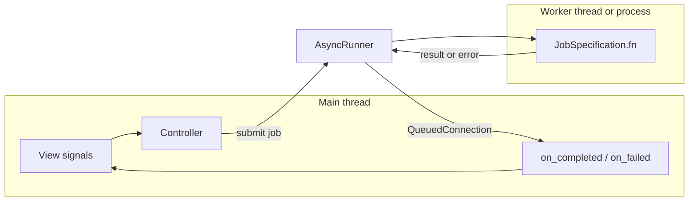

# How to create and submit async jobs

This guide describes how background work is queued in AROW, how results return to the Qt **main thread**, and how to plug in **custom callbacks**. It matches the implementation in `controller/async.py` and `controller/controller.py`.

## Mental model

| Layer | Role |
|--------|------|
| **View (`gui/`)** | Emits signals or calls controller methods in response to UI events. Must not block on slow I/O or CPU-heavy work. |
| **Controller (`controller/`)** | Decides *when* to run work, builds `JobSpecification`, connects completion callbacks, and applies results to the model or view on the main thread. |
| **Core (`core/`)** | Holds domain logic: pure functions, model methods, or small helpers that perform the actual work (ADB, startup, pairing, etc.). |

Heavy or blocking operations should run **outside** the GUI thread. The app routes them through a single **`AsyncRunner`** (typically owned by `AppController`), using **`JobSpecification`** and **`JobHandler`**.

## End-to-end pathway

1. **Something triggers the controller** — for example a global `view_signals` handler, a menu action, or a model event wired in `_connect_model_signals`.
2. **The controller submits a job** — usually via `Controller._submit_model_async_call(...)`, which wraps `AsyncRunner.submit(JobSpecification(...))` and binds per-job signals.
3. **The runner picks a pool** — thread vs process from `job_type` or `"auto"` (see below).
4. **The worker runs `JobSpecification.fn`** — with `args` / `kwargs`. This runs in a **worker thread or process**, not on the Qt main thread.
5. **Completion is marshaled to the main thread** — `AsyncRunner` uses internal Qt signals with `QueuedConnection` so **`Completed`**, **`Failed`**, and **`Cancelled`** slots run on the GUI thread.
6. **Your callbacks update state** — validate the result type, call `apply_main_thread`-style helpers on the model, refresh the view, or log failures.



## Preferred API: `_submit_model_async_call`

`Controller` exposes a single helper intended for model-side async work:

```python
handle = self._submit_model_async_call(
    name="my_job",
    fn=my_callable,
    description="Optional human-readable description",
    args=(),
    kwargs={},
    on_completed=my_on_completed,   # Callable[[object], None]
    on_failed=my_on_failed,          # Callable[[JobError], None]
    on_cancelled=my_on_cancelled,    # Callable[[], None]
    on_progress=my_on_progress,      # Callable[[ProgressEvent], None]
    job_type="auto",                # "auto" | "thread" | "process"
    timeout=None,                   # seconds, passed to Future.result()
    priority=0,
    coalesce_key=None,
)
```

- **`fn`**: callable executed in the background. Often `self.model.some_method` or a thin wrapper that calls `core` helpers.
- **Callbacks**: optional; each connected slot runs on the **Qt main thread** after the runner emits the corresponding signal (see docstring on `_submit_model_async_call` in `controller/controller.py`).
- **Return value**: a **`JobHandler`** — use `handle.job_id` with `runner.cancel(job_id)` if you need to cancel (see “Cancellation” below).

Subcontrollers that do not inherit `Controller` (e.g. `AdbSubController`) typically delegate with:

```python
def _submit_model_async_call(self, *args, **kwargs):
    return self._app._submit_model_async_call(*args, **kwargs)
```

so every domain module shares **one** `AsyncRunner` from `AppController`.

## Lower-level API: `JobSpecification` + `submit` + `bind_handle_signals`

You can submit directly on the runner when you do not need the controller helper:

```python
from controller.async import JobSpecification, AsyncRunner

runner: AsyncRunner = ...
job = JobSpecification(
    name="explicit_job",
    fn=callable,
    args=(),
    kwargs={},
    type="thread",        # or "process" or "auto"
    coalesce_key=None,
    timeout=None,
)
handle = runner.submit(job)
signals = runner.bind_handle_signals(handle)
signals.Completed.connect(my_slot)
signals.Failed.connect(my_failed_slot)
```

`bind_handle_signals(handle)` returns **`JobHandlerSignals`**: `Progress`, `Completed`, `Cancelled`, `Failed`. The runner also exposes **`runner.signals`** with the same event types but includes **`job_id`** as the first argument — useful for logging or multiplexed listeners.

## Thread vs process (`job_type`)

`AsyncRunner._resolve_job_type` decides **`"auto"`** jobs:

- Explicit **`"thread"`** or **`"process"`** always wins.
- For **`"auto"`**, the **name** (lowercased) and **`coalesce_key`** steer the choice: map-like / network-ish defaults favor **process**; **location** / **device** keys favor **thread**; otherwise the default is **process** so the UI stays responsive under CPU-heavy work.

When you know the workload (quick I/O vs heavy CPU), set **`job_type`** explicitly instead of relying on naming.

**Process pool caveat:** work runs in a separate process. The target callable must be **picklable** (top-level functions or picklable objects). Prefer **`"thread"`** for lambdas that close over complex objects, or keep **`fn`** as a module-level or clearly picklable entry point.

## Coalescing

If **`coalesce_key`** is set, submitting a new job with the same key **cancels the previous** pending job for that key (the runner marks its cancel token so completion resolves as **cancelled** rather than competing with the new job). Use this for “latest wins” flows (for example repeated device refreshes).

## Cancellation

- **`runner.cancel(handle.job_id)`** marks the job cancelled.
- The worker **`fn` does not automatically receive `CancelToken`** today; long-running core code would need an explicit contract if cooperative cancellation inside **`fn`** is required.

## Progress updates

`ProgressEvent` and **`on_progress`** / **`JobHandlerSignals.Progress`** are wired through **`AsyncRunner`**. The standard thread/process **`submit`** path does not inject an automatic progress callback into **`fn`**; emitting progress requires either extending the runner/pools or another agreed mechanism. Connecting **`on_progress`** is correct when you have a source of **`ProgressEvent`** instances.

## Custom callbacks (project pattern)

Existing code keeps completion handlers in dedicated modules (see **`controller/adb_job_callbacks.py`**):

1. **Small classes** with **`on_completed(self, result: object)`** and **`on_failed(self, error: JobError)`**.
2. **`__slots__`** plus **`__weakref__`** on the class when methods are used as Qt signal slots (Qt may weak-reference bound methods).
3. **Validate `result`** before touching model/view; log unexpected types.
4. **Apply model mutations on the main thread** inside **`on_completed`** — possibly via helpers such as **`apply_main_thread`** in **`core/`** when startup-style results bundle main-thread work.

This keeps async submission sites readable (only **`fn`** and callback references) and centralizes error handling.

## Types you will import

| Symbol | Module |
|--------|--------|
| `AsyncRunner`, `JobSpecification`, `JobHandler`, `JobHandlerSignals` | `controller.async` |
| `JobError`, `ProgressEvent`, `CancelledError` | `controller.async` |
| `_submit_model_async_call` | `Controller` subclasses (`AppController`, …) |

Tests with a fake runner live under **`core/test_async_runner.py`** for behavioral examples.

## Checklist for a new async job

1. Implement or reuse **core** logic callable as **`fn`** (returns a clear result type).
2. Choose **`job_type`** (and **`coalesce_key`** if “latest wins” applies).
3. Implement **`on_completed`** / **`on_failed`** (and optionally **`on_cancelled`**) with type checks and main-thread-safe updates.
4. Submit via **`_submit_model_async_call`** from a **`Controller`** (or subcontroller delegating to **`AppController`**).
5. Avoid blocking the GUI thread; keep **`fn`** from touching Qt widgets directly.
