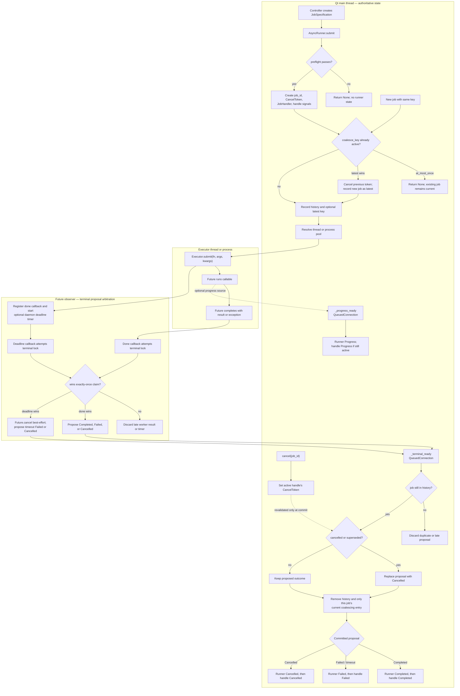

# AsyncRunner internals

Companion to [`runner.py`](runner.py). Start with
[`HOW_TO_async_jobs.md`](../../docs/HOW_TO_async_jobs.md) for the application-level
contract; this guide focuses on the runner's concurrency, state ownership, and
terminal-event races.

## Mental model

`AsyncRunner` has two distinct responsibilities:

1. Submit blocking callables to a thread or process executor.
2. Make their outcomes observable safely on the Qt main thread.

The worker side never emits public terminal signals. It proposes one terminal
outcome. The Qt main thread is the commit point that decides whether that outcome
is still current, cleans the job, and only then emits public signals.

| Owner | State and responsibility |
|---|---|
| Controller / Qt main thread | Calls `submit()` and `cancel()`. Owns `history`, `_coalesce_latest`, and all application-visible signals. |
| `_ExecutorPool` | Implements executor submission, future observation, and shutdown once for both pool types. |
| `ThreadPool` / `ProcessPool` | Thin subclasses that construct the appropriate executor; the process variant also configures isolated worker logging. |
| Thread or process executor | Runs `JobSpecification.fn(*args, **kwargs)`. Running work is not forcibly stopped. |
| Future observer | Arbitrates future completion against the deadline under a lock. Exactly one terminal proposal wins. |
| Deadline timer | Starts after executor submission, calls `Future.cancel()` best-effort, and proposes a timeout failure if it wins. |
| Qt terminal commit point | Rechecks cancellation and coalescing, cleans state, then emits one terminal event. |

## Complete lifecycle

## Submission decisions

`JobSpecification` controls dispatch and lifecycle behavior:

- `preflight`: evaluated synchronously before a `job_id` or runner state is
  created. `False` returns `None` without opening worker work.
- `type`: a required explicit `"thread"` or `"process"` choice. The runner never
  infers a pool from the job name or coalescing key.
- `coalesce_key`: identifies jobs where only the latest result is useful.
- `at_most_once`: rejects a new job while the keyed job is active. Without it, a
  new keyed job cancels the previous token and becomes current.
- `timeout`: a positive finite number of seconds. The deadline begins at executor
  submission; `None` means no deadline.
- `priority`: currently descriptive metadata. The standard executors do not use
  it to reorder work.

The returned `JobHandler` is opaque application state: use its `job_id` for
cancellation and pass it to `bind_handle_signals()` while it remains active.

`submit()` is intentionally a short orchestration pipeline. It validates the
callable, checks `_passes_preflight()`, registers the job through
`_register_job()`, and delegates its explicit pool choice to `_dispatch()`.
Coalescing policy is isolated in `_reserve_coalescing_slot()`, and worker
callbacks cross into Qt through the reusable `_marshal_progress()` and
`_marshal_terminal()` methods. Keep new submission policy in the focused helper
that owns it instead of adding branches back to `submit()`.

## Why terminal handling has two stages

The future observer and Qt commit point solve different races.

### Stage 1: propose exactly once

`_observe_future()` arbitrates worker completion and timeout with a lock. The
winner cancels the deadline timer where appropriate and creates one private
proposal:

- `_CompletedProposal(result)`
- `_FailedProposal(JobError)`
- `_CancelledProposal()`

If a timeout wins, queued executor work is cancelled when possible. A thread or
process task that has already started continues safely in the background, and
its later result is discarded by the observer.

### Stage 2: commit what is still valid

A proposal can wait in Qt's event queue while the user cancels its job or a newer
job takes ownership of the same coalescing key. `_commit_terminal()` therefore
checks the latest main-thread state immediately before visibility:

1. A proposal for a job absent from `history` is late or duplicated and is
   discarded.
2. A cancelled or superseded job commits as `Cancelled`, regardless of whether
   the queued proposal was completion, failure, or timeout.
3. Cleanup happens before notification, so reentrant listeners see the job as
   inactive.
4. Runner-level terminal signals emit before the corresponding handle-level
   signal.

This is the central invariant: **a worker outcome is not an application outcome
until the Qt main thread commits it.**

## State invariants

- `history[job_id]` contains the active `JobHandler` and its
  `JobHandlerSignals`.
- `_coalesce_latest[key]` points only to the current job for that key.
- Cleaning an older superseded job must not remove the newer job's coalescing
  entry.
- A terminal commit removes active state exactly once before emitting public
  terminal signals.
- A missing history entry makes all later terminal proposals inert.
- Cancellation changes terminal visibility; it does not terminate already
  running Python work or inject `CancelToken` into `fn`.

Progress follows a separate queued path. Runner-level `Progress` is forwarded
when its Qt event arrives; handle-level `Progress` is emitted only if the job is
still active. The standard pool submission path does not currently inject a
progress callback into `fn`.

## Debugging checklist

Follow one `job_id` through structured logs and inspect the first point where its
expected transition is missing.

| Symptom | Inspect | Likely explanation |
|---|---|---|
| `submit()` returns `None` | `preflight`, `at_most_once`, and `coalesce_key` | Submission was intentionally skipped before executor dispatch. |
| Expected completion becomes cancellation | `CancelToken.is_cancelled()` and `_coalesce_latest[key]` at commit | The job was cancelled or replaced while its proposal waited in Qt. |
| Timeout appears while work continues | Deadline log followed by worker activity | Expected: running executor work cannot be killed; its late result is ignored. |
| No second terminal signal for a late result | `history` membership and “Late async … discarded” logs | Expected at-most-once behavior after timeout or cleanup. |
| A new coalesced job disappears unexpectedly | `_cleanup()` key comparison | Cleanup must delete a key only when it still points to the finishing `job_id`. |
| Callback cannot be bound | `history` membership before `bind_handle_signals()` | Binding happened after terminal cleanup; bind immediately after submission. |
| Failure lacks useful routing | `JobError.origin`, `exception_type`, and `traceback` | `origin` should be the `JobSpecification.name`; timeout tracebacks are intentionally empty. |
| UI callback runs on the wrong thread | `_terminal_ready` connection and runner affinity | The internal signal must remain a `QueuedConnection`, and the runner must live on the Qt main thread. |

The focused regression suite is
[`tests/test_async_runner.py`](tests/test_async_runner.py). It covers both pool
paths, deadline arbitration, main-thread affinity, manual cancellation between
proposal and commit, coalescing races, cleanup ordering, and duplicate proposal
suppression.

## Safe extension rules

- Keep worker callbacks limited to producing private proposals; never emit public
  terminal signals from an executor callback.
- Add new terminal outcomes to the private proposal union and handle them only in
  `_commit_terminal()`.
- Preserve cleanup-before-notification ordering.
- Reproduce concurrency bugs by controlling the exact boundary involved: worker
  completion, observer proposal, Qt queue, or main-thread commit.
- Add deterministic tests using events or fake pools instead of sleeps whenever
  possible.
- Keep domain mutation out of the runner. Completed values and `JobError` objects
  are transported here; their application belongs to the core entrypoint and
  work appliers.
