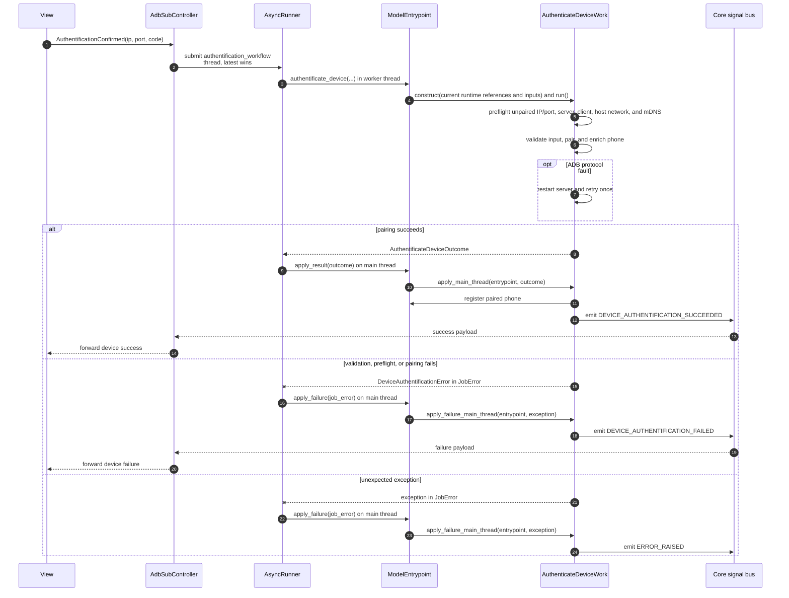

# Authenticate device async flow

Companion to [`authentificate_device_work.py`](authentificate_device_work.py).
For shared runner and dispatch conventions, see
[`HOW_TO_async_jobs.md`](../../../docs/HOW_TO_async_jobs.md).

**Job:** `authentification_workflow` | **Pool:** thread | **Coalesce key:**
`authentification`

