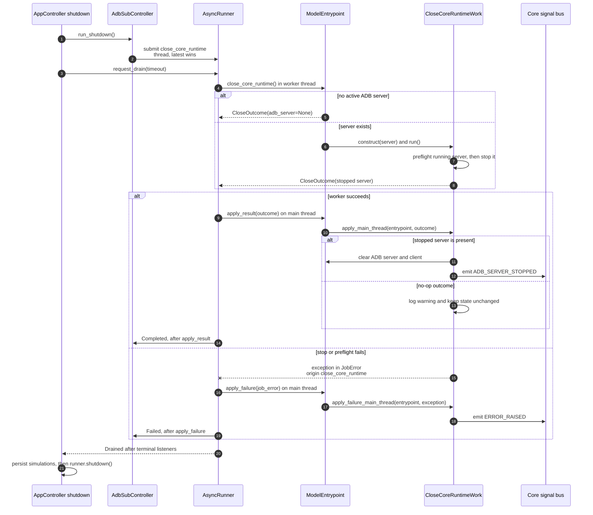

# Close core runtime async flow

Companion to [`close_work.py`](close_work.py). For shared runner and dispatch
conventions, see [`HOW_TO_async_jobs.md`](../../../docs/HOW_TO_async_jobs.md).

**Job:** `close_core_runtime` | **Pool:** thread | **Coalesce key:** `close`

The runner evaluates drains after runner-level and handle-level terminal
listeners. The entrypoint result or failure applier therefore completes before
`Drained` advances application teardown. No nested Qt event loop or controller
callback hook is involved. If the close deadline expires, the application stays
alive and an unbounded drain continues observing the already-started close.
