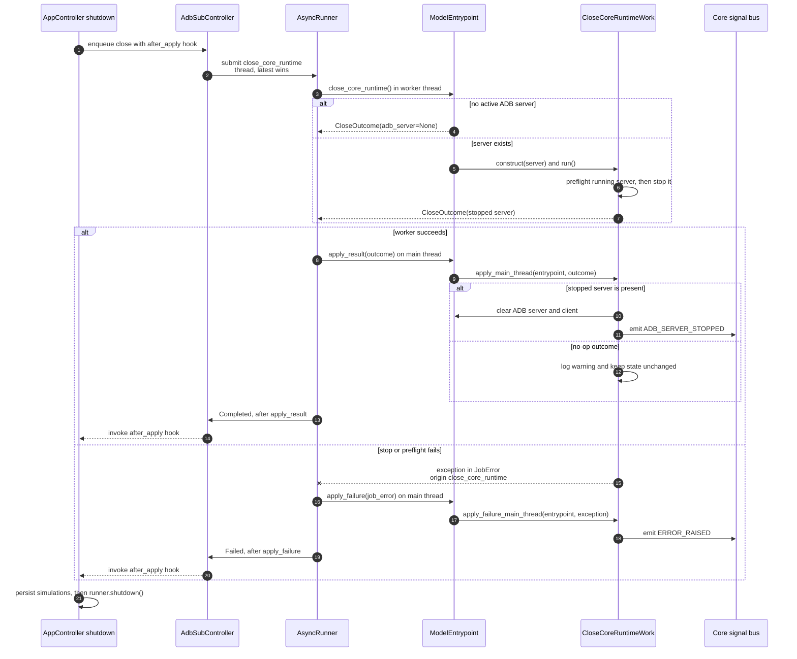

# Close core runtime async flow

Companion to [`close_work.py`](close_work.py). For shared runner and dispatch
conventions, see [`HOW_TO_async_jobs.md`](../../HOW_TO_async_jobs.md).

**Job:** `close_core_runtime` | **Pool:** thread | **Coalesce key:** `close`

The shutdown event loop is released only by the post-apply handler (or its
watchdog), so runner shutdown cannot normally overtake result/failure application.
