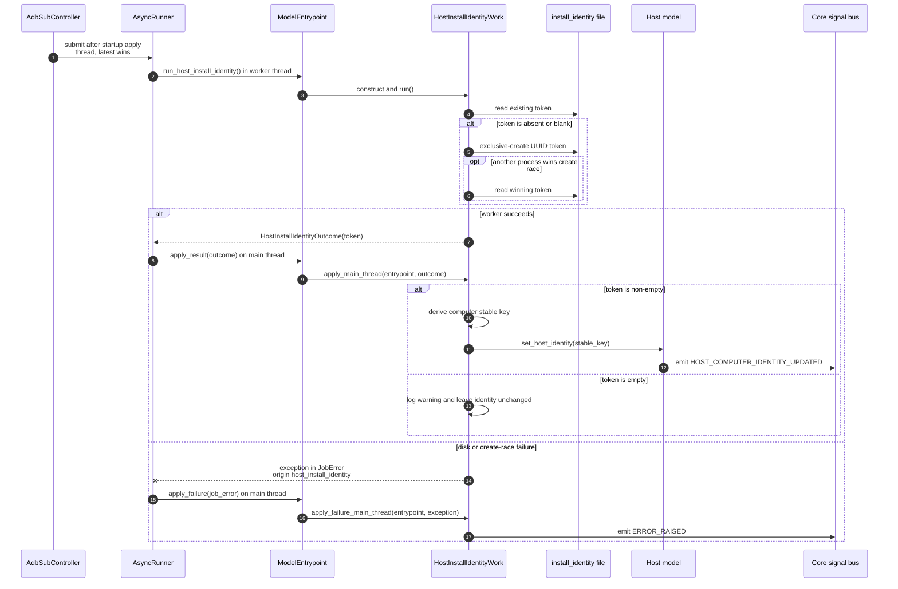

# Host install identity async flow

Companion to [`host_install_identity_work.py`](host_install_identity_work.py).
For shared runner and dispatch conventions, see
[`HOW_TO_async_jobs.md`](../../HOW_TO_async_jobs.md).

**Job:** `host_install_identity` | **Pool:** thread | **Coalesce key:**
`host_install_identity`

