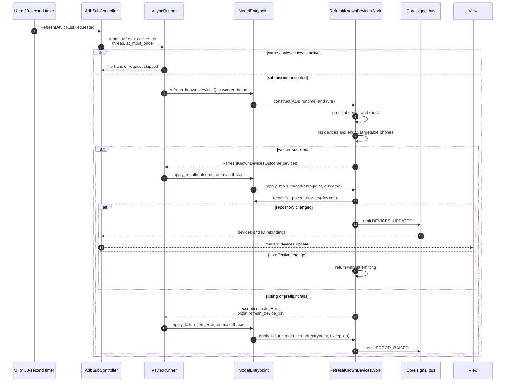

# Refresh known devices async flow

Companion to [`refresh_known_devices_work.py`](refresh_known_devices_work.py).
For shared runner and dispatch conventions, see
[`HOW_TO_async_jobs.md`](../../HOW_TO_async_jobs.md).

**Job:** `refresh_device_list` | **Pool:** thread | **Coalesce key:**
`refresh_device_list` | **Policy:** at most once

Shell property reads are best-effort inside `AdbClient`; degraded enrichment can
still produce a successful outcome. Device listing failures fail the job.
