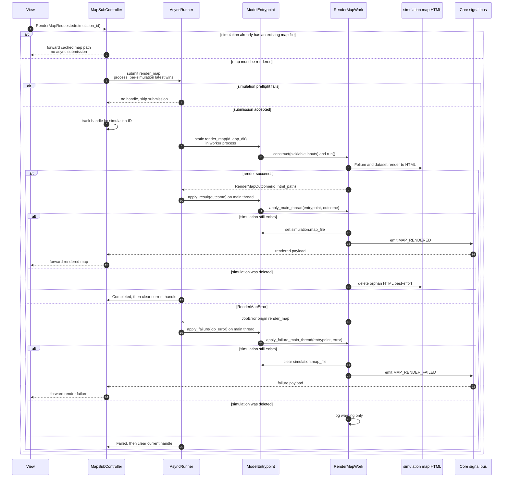

# Render map async flow

Companion to [`render_map_work.py`](render_map_work.py). For shared runner and
dispatch conventions, see [`HOW_TO_async_jobs.md`](../../HOW_TO_async_jobs.md).

**Job:** `render_map` | **Pool:** process | **Coalesce key:**
`render_map:<simulation_id>`

Deleting a simulation also cancels its tracked render handle. If a newer render
supersedes an older one, only the current handle is cleared when terminal signals
arrive.
