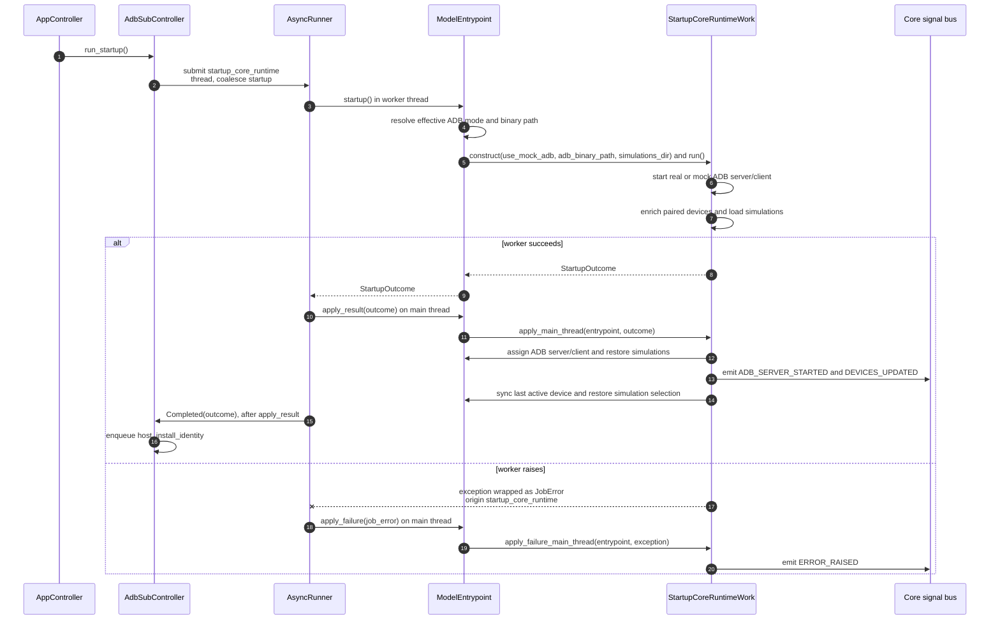

# Startup core runtime async flow

Companion to [`startup_work.py`](startup_work.py). For shared runner and dispatch
conventions, see [`HOW_TO_async_jobs.md`](../../../docs/HOW_TO_async_jobs.md).

**Job:** `startup_core_runtime` | **Pool:** thread | **Coalesce key:** `startup`

The host identity submission is connected after `apply_result`, so it cannot run
until startup state and signals have been applied.
