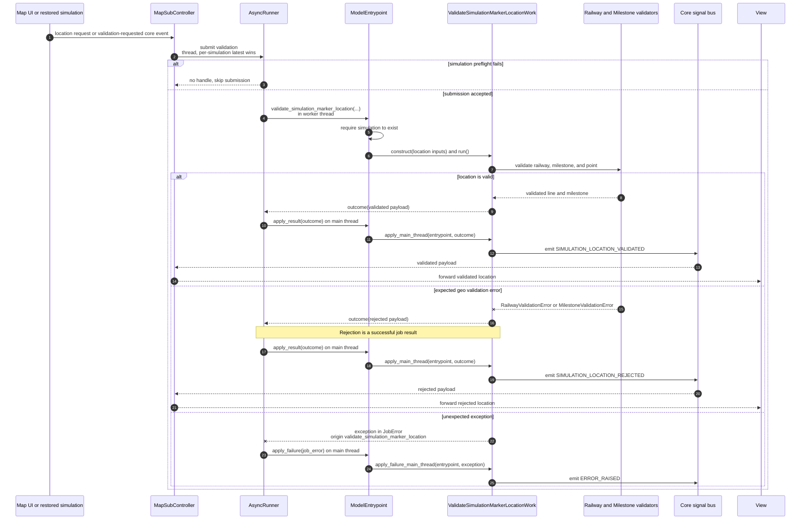

# Validate simulation marker location async flow

Companion to
[`validate_simulation_marker_location_work.py`](validate_simulation_marker_location_work.py).
For shared runner and dispatch conventions, see
[`HOW_TO_async_jobs.md`](../../HOW_TO_async_jobs.md).

**Job:** `validate_simulation_marker_location` | **Pool:** thread | **Coalesce
key:** `validate_simulation_marker_location:<simulation_id>`

